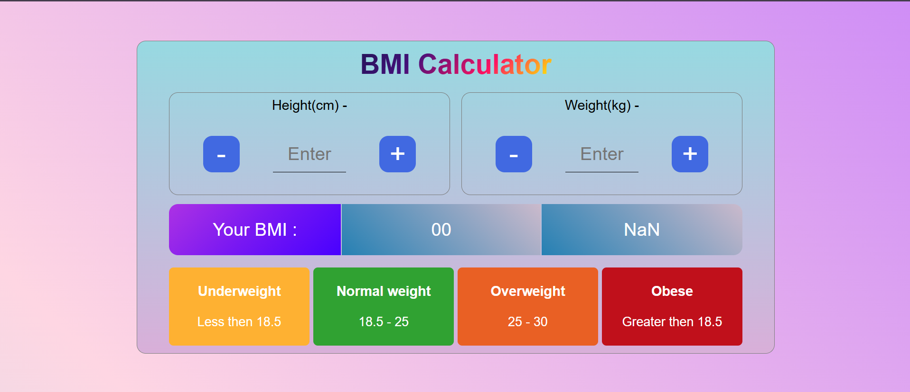

# ⚖️ BMI Calculator

A clean and responsive Body Mass Index (BMI) Calculator built with React. Quickly compute your BMI based on your height and weight, with real-time feedback and visually distinct health categories.

---

## 🔗 Live Demo

👉 [https://bmi-calculator-gules-five.vercel.app/](https://bmi-calculator-gules-five.vercel.app/)

---

## 📸 Screenshots

| Screenshots                                 |
| ------------------------------------------- |
|  |

---

## 🚀 Features

- ✅ Real-time BMI calculation
- 📏 Adjustable height (in cm) and weight (in kg) with increment/decrement buttons
- 🎨 Dynamic background color based on BMI result
- 🧠 Displays BMI category (Underweight, Normal, Overweight, Obese)
- 📱 Fully responsive UI

---

## 🧰 Tech Stack

- ⚛️ [React](https://reactjs.org/) — Frontend JavaScript library
- ⚙️ [Vite](https://vitejs.dev/) — Lightning fast build tool

---

## 🧪 Getting Started

### 📦 Installation

Clone the repo :

```bash
git clone https://github.com/PARTHA-PATTANAYAK-02/Bmi_Calculator.git
cd Bmi_Calculator
```

install dependencies:

```bash
npm install
```

also see the package.json

Run the development server :

```bash
npm run dev
```

---

## 🌐 Deployment

## This project can be deployed easily using:

- ### 🔗 [vercel](https://bmi-calculator-gules-five.vercel.app//)

## ✍️ Author

**Made with ❤️ by [Partha Pattanayak](https://github.com/PARTHA-PATTANAYAK-02)**
